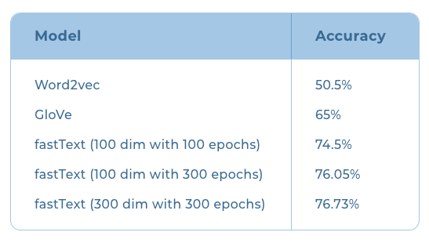

# Word Embedding Studies

### Malayalam Word Embedding with three models

This QBurst Blog evaluates Malayalam Word Embedding with **Word2Vec, GloVe and Fastext**. Result detailed here. Need to replicate for a good analysis.&#x20;

[https://blog.qburst.com/2020/11/generating-malayalam-word-embeddings-a-case-study/](https://blog.qburst.com/2020/11/generating-malayalam-word-embeddings-a-case-study/)\
\
They have evaluated based on a test set they created for intrinsic evaluation. It has three columns, first two are words that are from same category (eg: ഹിന്ദി, മലയാളം) and the third column contains a word from a different category (eg: മാങ്ങ).  If the Embedding model can correctly evaluate the similarity using cosine similarity metric, it is a hit.

Trained on Common crawl 2018, they got the best result for Fastetxt model.

<figure><figcaption></figcaption></figure>

### Sentence BERT - L3Cube Pune



* Evaluation dataset is unclear.
* Embedding Similarity and classification accuracy are the tasks for evaluation.

###
